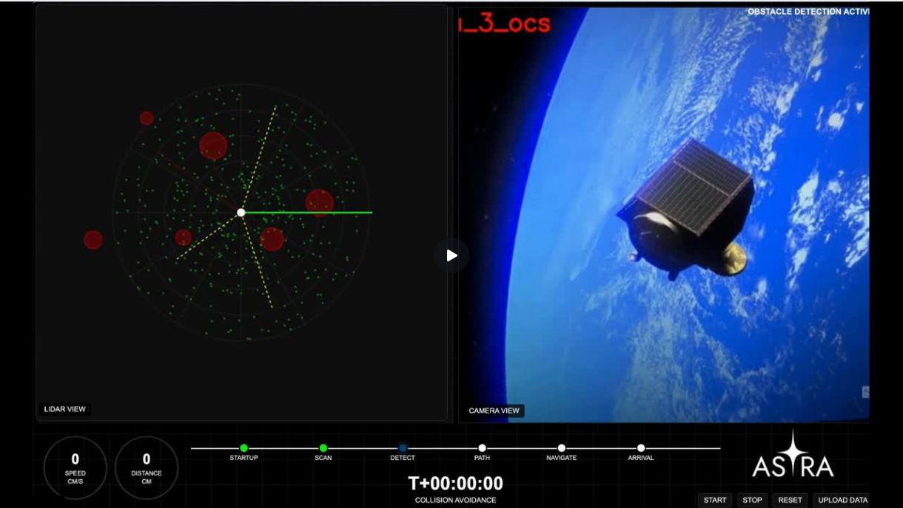
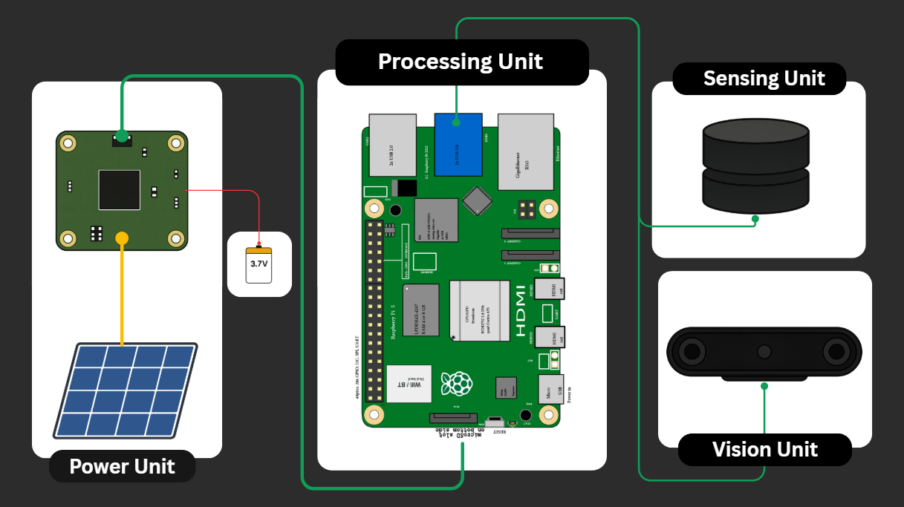
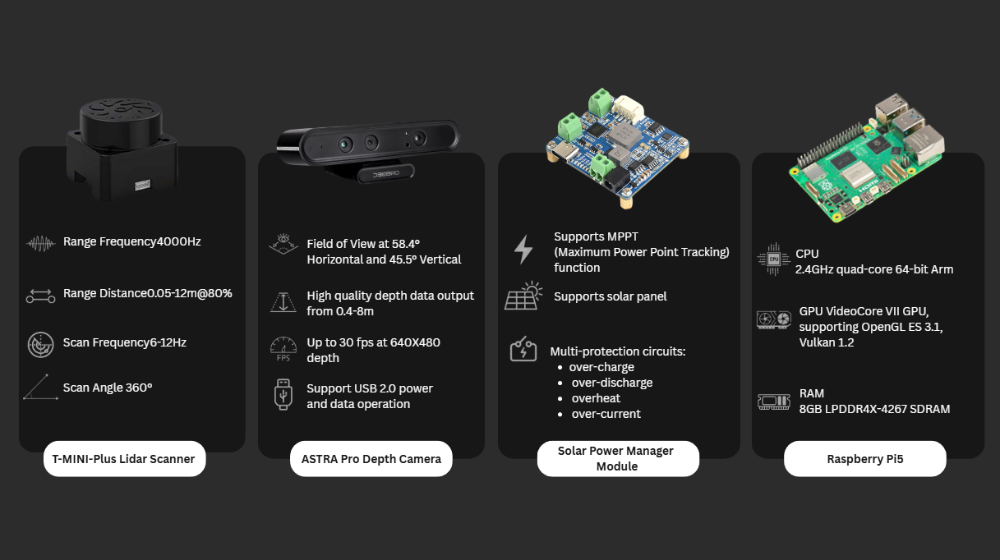
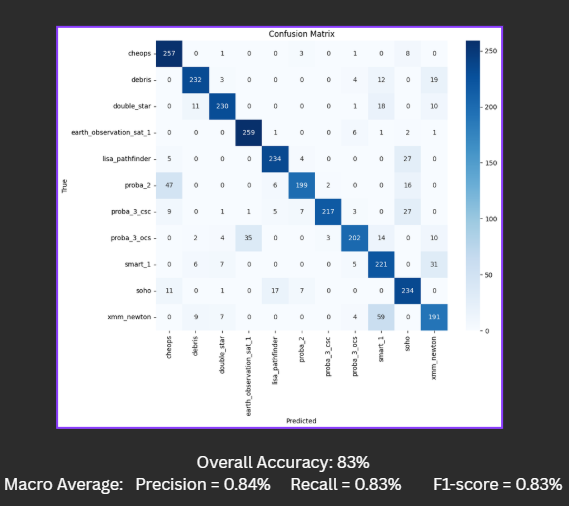

# ASTRA – AI-Based Space Debris Detection System

ASTRA (Advanced Satellite for Tracking and Removal of Anomalies) is a graduation project developed at Taif University. The project explores the use of Artificial Intelligence, Computer Vision, and Embedded Systems for space debris detection, classification, and autonomous navigation concepts.

## Technologies

* Python
* OpenCV
* YOLO
* TensorFlow
* MobileNet
* Raspberry Pi 5
* Linux

## Features

* AI-based object detection and classification
* Computer Vision integration
* Sensor integration using LiDAR and depth camera
* Autonomous navigation concepts
* Real-time monitoring dashboard
* Testing and validation framework

## Team Contributions & My Involvement

As a member of the project team, I contributed to:

* Computer Vision component integration
* Testing and validation
* Data collection
* System evaluation
* Project development support

## System Architecture

The ASTRA system consists of four primary subsystems:

* Power Unit
* Processing Unit
* Sensing Unit
* Vision Unit

The Raspberry Pi 5 acts as the central processing unit, integrating sensor data and supporting real-time decision making.

## Hardware Components

Main hardware used in the project:

* T-MINI Plus LiDAR Scanner
* Astra Pro Depth Camera
* Solar Power Manager Module
* Raspberry Pi 5

## Classification Performance

The debris classification model was evaluated using a multi-class confusion matrix.

### Results

* Overall Accuracy: 83%
* Precision: 84%
* Recall: 83%
* F1-Score: 83%

## Web Interface

ASTRA includes a real-time monitoring dashboard for monitoring detections, navigation status, and sensor information.

### Dashboard Features

* LiDAR visualization
* Camera monitoring
* Collision avoidance status
* Navigation timeline
* Real-time telemetry
* System controls

## Documentation

* [Project Report](documentation/ASTRA_Project_Report.pdf)
* [Project Presentation](documentation/ASTRA_Project_Presentation.pdf)

## Academic Information

Bachelor's Degree in Computer Science
Taif University
2024–2025

## Disclaimer

This repository is intended to showcase the project structure, technologies, and development process used during the graduation project. Some implementation details may be simplified or omitted.
